# Third-Person Shooters Prototype Game

A Unity third-person shooter prototype focused on data-driven combat, enemy encounters, inventory management, and status effects. The project is under active development; animation, enemy AI, and overall gameplay balance are still being refined.

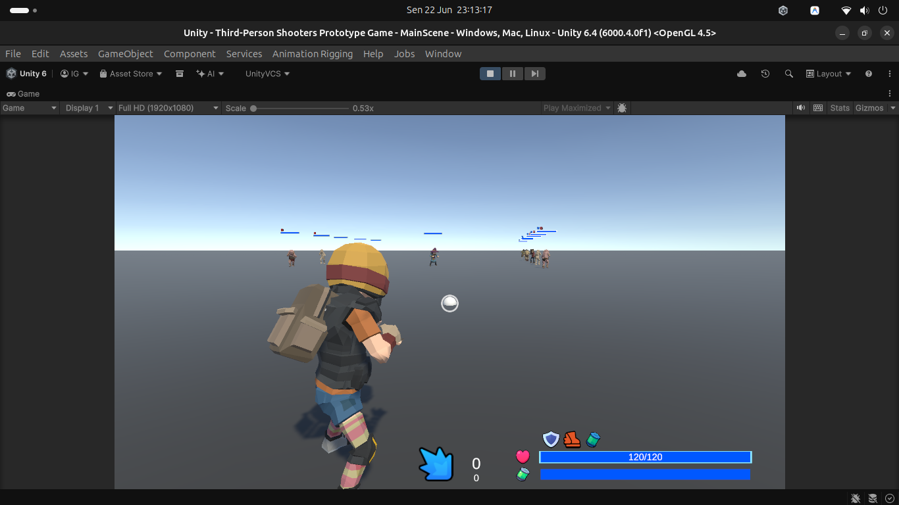

## Download and Play

The current public build is a pre-release prototype: [Third_Person_Shooters_Prototype_v0.00.001-alpha.1](https://github.com/IkbalGumilar/Third-Person-Shooters-Prototype-Game/releases/tag/v0.00.001-alpha.1).

Download the archive for your operating system. Do not use GitHub's automatically generated `Source code` archives to play the game.

| Platform | Download |
| --- | --- |
| Windows x64 | [Download ZIP](https://github.com/IkbalGumilar/Third-Person-Shooters-Prototype-Game/releases/download/v0.00.001-alpha.1/Third_Person_Shooters_Prototype_v0.00.001-alpha.1_Windows_x64.zip) |
| macOS | [Download ZIP](https://github.com/IkbalGumilar/Third-Person-Shooters-Prototype-Game/releases/download/v0.00.001-alpha.1/Third_Person_Shooters_Prototype_v0.00.001-alpha.1_MacOS.zip) |
| Linux x64 | [Download ZIP](https://github.com/IkbalGumilar/Third-Person-Shooters-Prototype-Game/releases/download/v0.00.001-alpha.1/Third_Person_Shooters_Prototype_v0.00.001-alpha.1_Linux_x64.zip) |

### Windows x64

1. Download and extract the Windows ZIP to any writable folder.
2. Keep the executable and its accompanying `_Data` folder together.
3. Run the included `.exe` file.
4. If Windows SmartScreen appears, choose `More info` and then `Run anyway` only after confirming the download came from this repository.

### macOS

1. Download and extract the macOS ZIP.
2. Open the included `.app` bundle.
3. If macOS blocks the first launch, Control-click the app, select `Open`, then confirm `Open` in the security prompt.

### Linux x64

1. Download and extract the Linux ZIP.
2. Open a terminal in the extracted folder.
3. Make the included game executable runnable:

   ```bash
   chmod +x ./<game-executable>
   ```

4. Start it from the same folder:

   ```bash
   ./<game-executable>
   ```

Replace `<game-executable>` with the executable file included in the extracted build folder.

## Highlights

- Third-person movement with free-look camera, aiming, crouching, crawling, jumping, rolling, and melee actions.
- One-hand, two-hand, unarmed, ranged, and melee combat animation paths.
- Weapon data stored in ScriptableObjects, including magazines, ammo, reload behavior, recoil, spread, critical hits, knockback, and penetration settings.
- Handgun, revolver, assault rifle, shotgun, and sniper weapon support.
- Aim IK and weapon grip points for one-hand and two-hand weapons.
- Sniper scope camera with zoom controls.
- Grid inventory with drag and drop, item sizes, quick weapon slots, item previews, item drop, and pickup interactions.
- Ammo, consumables, healing, stamina, shield, buffs, debuffs, and stackable status effects.
- Enemy patrol, chase, melee, ranged, shield, support, loot-drop, and pooled-spawn systems.
- World-space enemy health, regeneration, shield, and status-effect UI.

## Screenshots

| Combat and movement | Inventory and UI |
| --- | --- |
| 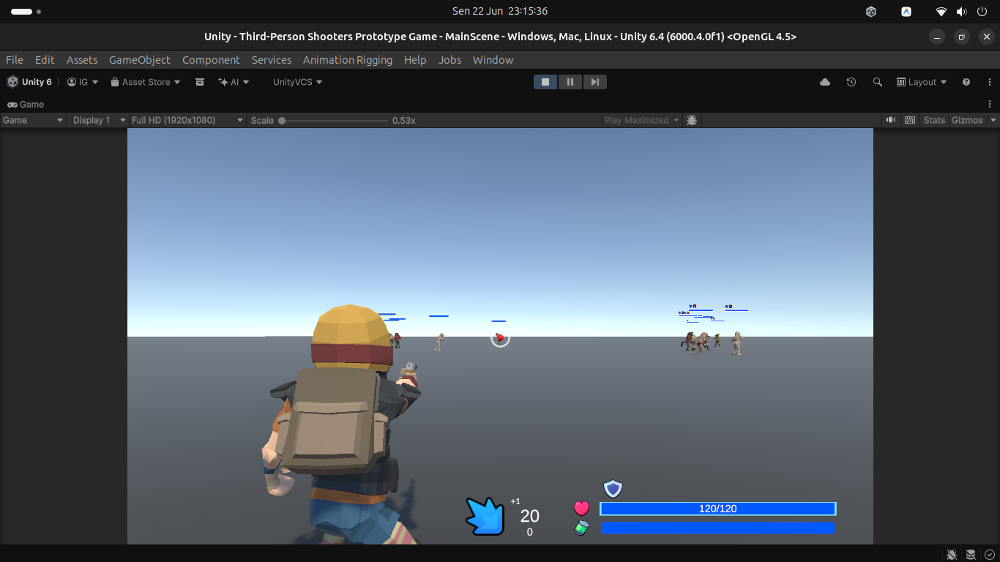 | 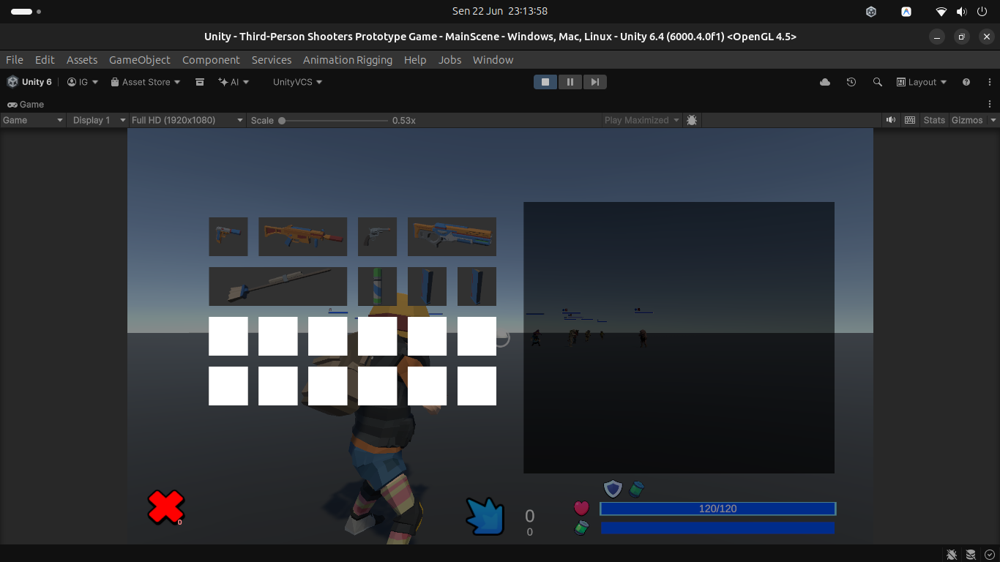 |
| 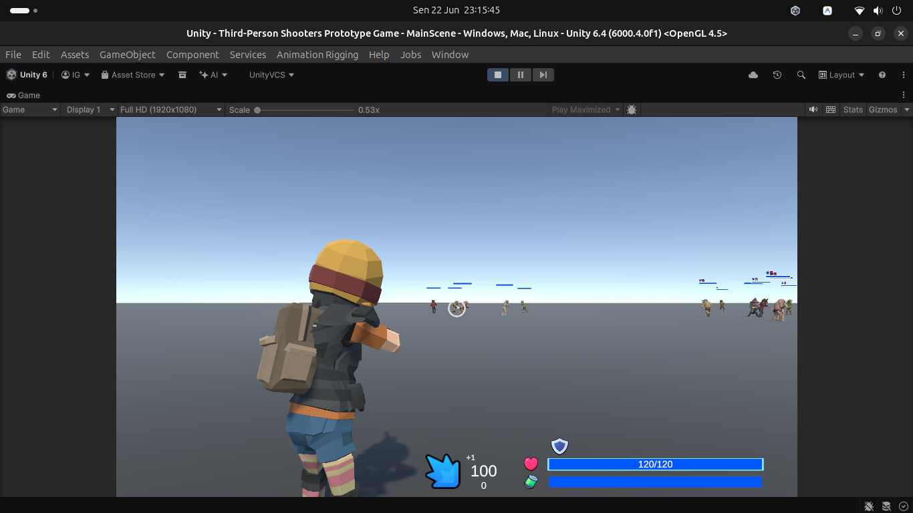 | 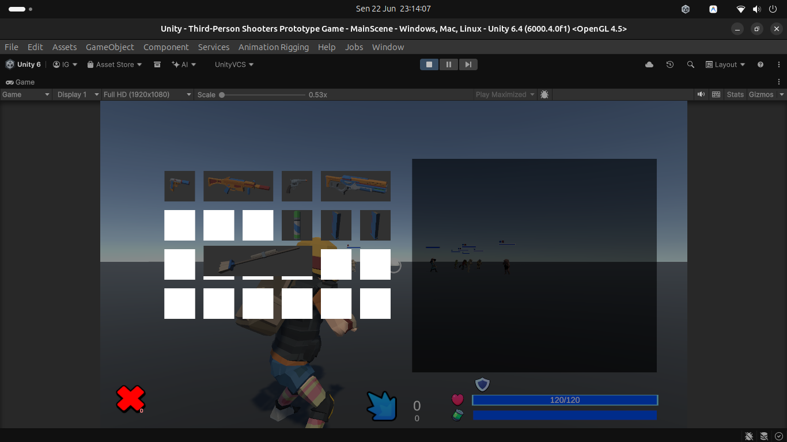 |
| 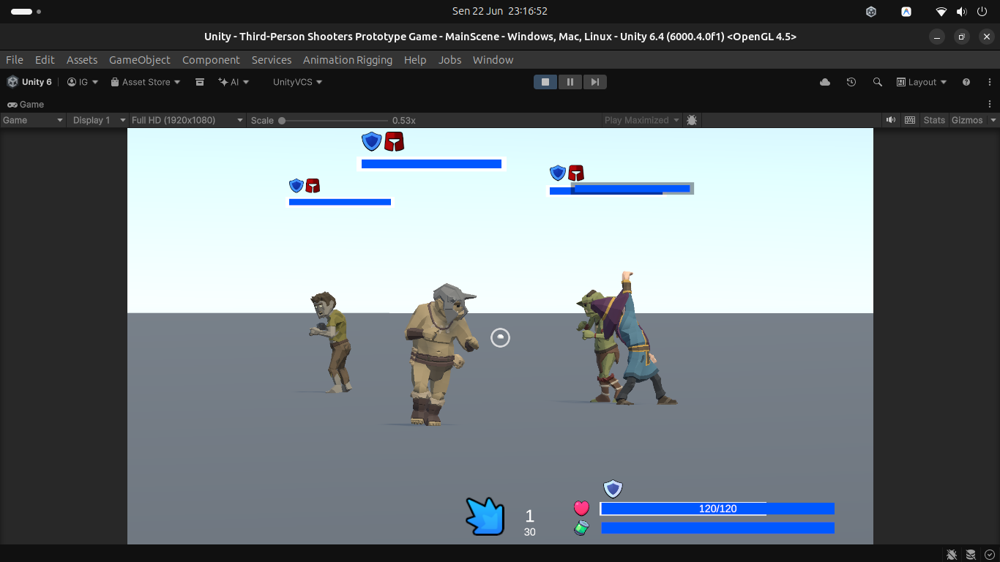 | 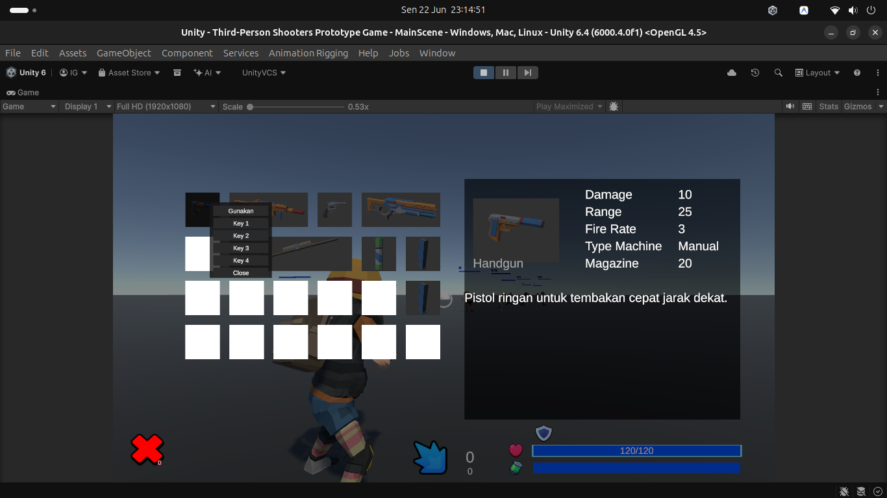 |
| 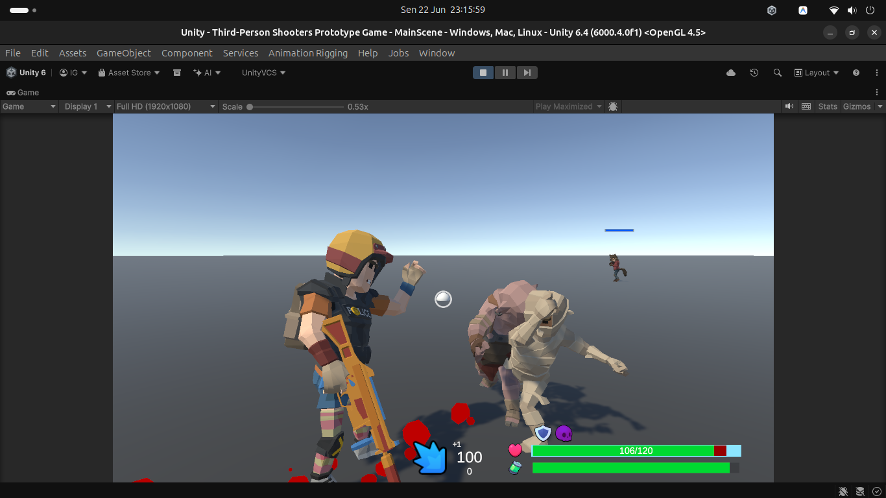 | 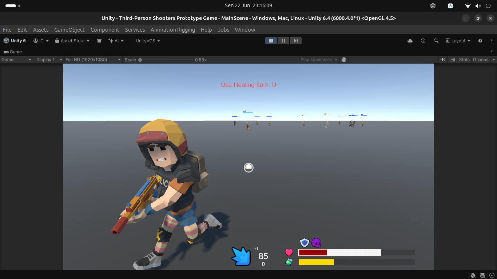 |
| 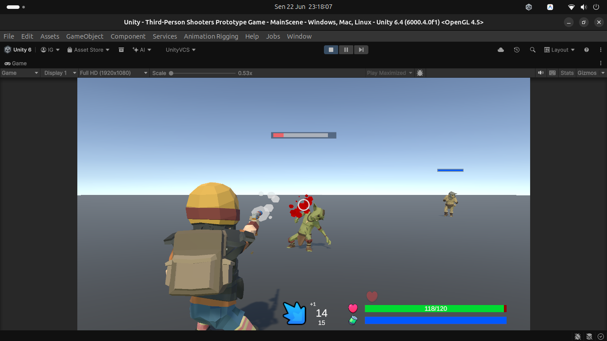 | 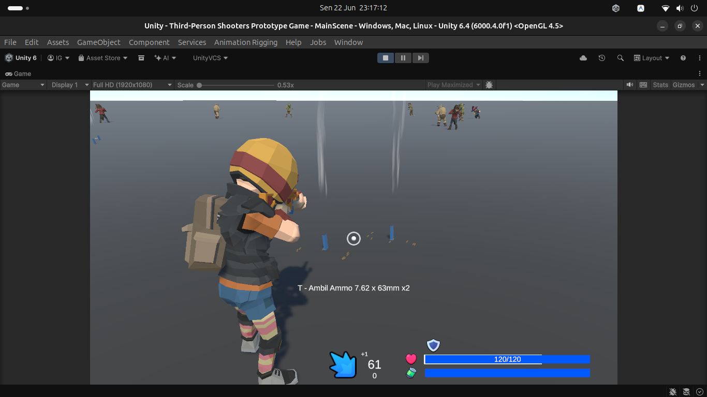 |

## Controls

| Input | Action |
| --- | --- |
| `W`, `A`, `S`, `D` | Move |
| Mouse | Look / rotate camera |
| Left Mouse Button | Fire or melee action, depending on the equipped weapon and state |
| Right Mouse Button | Aim |
| `Shift` | Run |
| `Space` | Jump |
| `Q` | Roll |
| `R` | Reload |
| `1` - `4` | Select assigned weapon quick slot |
| `I` | Open or close inventory |
| `Esc` | Close inventory |
| `U` | Use selected item or quick healing item |
| `T` | Pick up the nearest item |
| `V` | Unarmed physical melee |
| `B` | Weapon melee |

Control bindings are managed through the Unity Input System and can be extended for gamepad support.

## Core Systems

### Combat

Weapons use ScriptableObject data for their combat configuration. Current systems include magazines, reserve ammo, reload behavior, shotgun pellet spread, distance falloff, recoil, critical damage, knockback, hit effects, and weapon-specific animations.


### Inventory and Items

The inventory uses a grid layout. Items can occupy multiple slots, be moved with drag and drop, assigned to weapon quick slots, used, dropped into the world, and picked up again. Ammo stacks automatically when compatible inventory space is available.

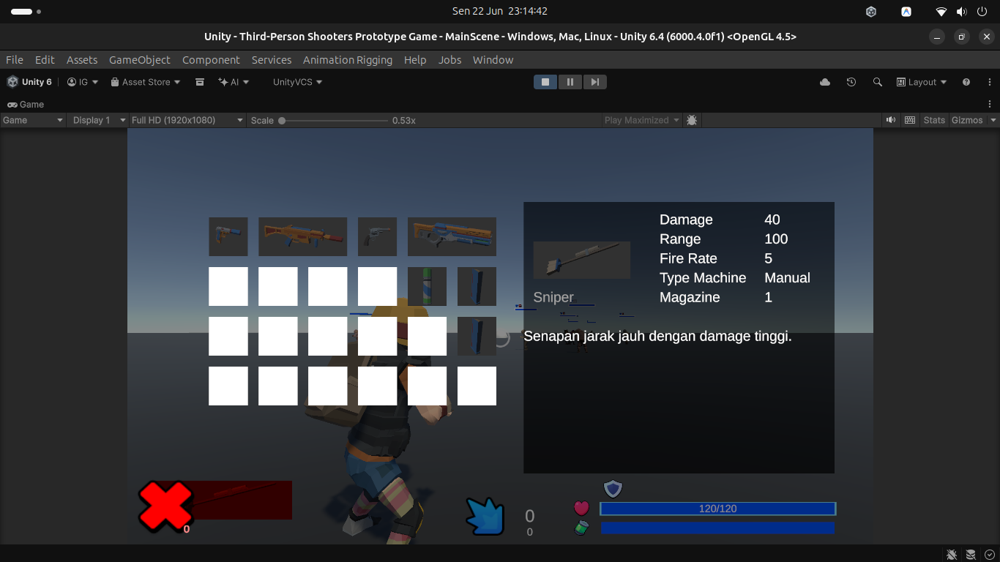

### Health, Shield, and Status Effects

The player and enemies support current health, delayed regeneration, stamina, shield points, visual regeneration bars, and status effects. Status effects can stack and display an icon, name, and duration in the HUD.

### Enemies

Enemy behavior includes patrol, alert, chase, melee and ranged attacks, shield behavior, support buffs, status effects, loot tables, death reactions, and Lean Pool spawning. Enemy configuration is data-driven through ScriptableObjects.

## Requirements

- Unity `6000.4.0f1`
- Unity Input System
- Cinemachine
- TextMeshPro
- Lean Pool

## Getting Started

The following instructions are for opening the Unity project, not for playing a released build. For a playable build, use the downloads above.

1. Clone the repository:

   ```bash
   git clone https://github.com/IkbalGumilar/Third-Person-Shooters-Prototype-Game.git
   ```

2. Open the project in Unity Hub using Unity `6000.4.0f1`.
3. Allow Unity to import all assets and resolve packages.
4. Open `Assets/Scenes/MainScene.unity`.
5. Press Play.

## Project Structure

```text
Assets/
  Scenes/                 Main gameplay scene
  Scripts/                Player, weapon, enemy, UI, inventory, and combat code
  Scripts/ScripTableObject/
                           Weapon, ammo, enemy, loot, melee, and status-effect data
  Resource/               Animator controllers, masks, prefabs, and effects
  Plugins/                Third-party plugins, including Lean Pool
Photos/                   README screenshots
Packages/                 Unity package dependencies
ProjectSettings/          Unity project settings
```

## Development Status

This is an active prototype. The following areas are currently under iteration:

- Player and enemy animation state transitions.
- Enemy AI behavior and combat coordination.
- Weapon, enemy, shield, and status-effect balance.
- Additional enemy archetypes, weapons, animations, and game content.

## Third-Party Assets and Credits

This project combines original work with assets, animation packs, plugins, and other content acquired from the Unity Asset Store. Asset ownership and licenses remain with their respective creators and publishers.

Before redistributing this project or its assets, verify the license of every third-party package and asset. Do not assume that purchased Unity Asset Store content can be redistributed publicly outside the terms of its original license.

## Version Control

Commit `Assets`, `Packages`, `ProjectSettings`, `Photos`, and every `.meta` file. Unity-generated cache folders such as `Library`, `Temp`, `Logs`, `obj`, and `UserSettings` should remain excluded through `.gitignore`.
